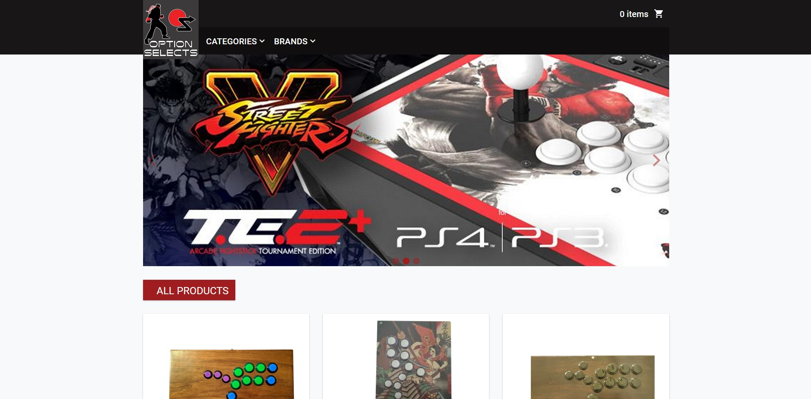

# option-selects
A full stack Node.js and React shopping cart app.

### Live Demo
Link: https://os.grantkang.com



### Technologies Used
* React
* Material-UI
* Node.js
* Express
* Node Fetch
* PostgreSQL
* Webpack
* Babel
* HTML5
* CSS3
* JavaScript

## Features

### Current
* User can view the products for sale
* User can view the details of a product
* User can add a product to their cart
* User can add product to their cart
* User can view their cart summary
* User can place an order

### Planned
* TBD

## Getting Started

### Prerequisites
* Node.js 10 or higher
* NPM 6 or higher
* PostgresQL 10 or higher

### Database Setup

1. If PostgreSQL isn't already running, start it & sign in.
    ```shell
    $ sudo service postgresql start
    $ psql
    ```
2. While signed into PostgreSQL, create a **new database** using the following SQL command.
    ```sql
    create database "optionSelects";
    ```
3. Still signed into PostgreSQL, create a **new user** and remember the credentials. You'll be needing them for the configuration file.
    ```sql
    create user "optionSelects" with password 'superstrongpassword';
    ```
4. Still signed into PostgreSQL, give your new user full control over your new database with the following SQL command.
    ```sql
    grant all privileges on database "optionSelects" to "optionSelects";
    ```
5. Sign out of PostgreSQL with the following command. You should be returned to your bash prompt.
    ```sql
    \quit
    ```
### Environment Setup

1. Clone the repository.
    ```shell
    $ git clone https://github.com/grantkang/option-selects.git
    ```
2. Once inside the project directory, install the dependencies.
    ```shell
    $ npm install
    ```
3. Copy the `.env.example` file & name it `.env`.
    ```shell
    $ cp .env.example .env
    ```
4. Edit the `.env` file to include your database credentials.
    ```
    PORT=3001
    DEV_SERVER_PORT=3000
    DATABASE_URL=postgres://<username>:<password>@localhost/optionSelects
    SESSION_SECRET=secret
    ```
5. Import the sample database
    ```shell
    $ npm run db:import
    ```
6. Run the dev script & visit http://localhost:3000 on your browser
    ```shell
    $ npm run dev
    ```
